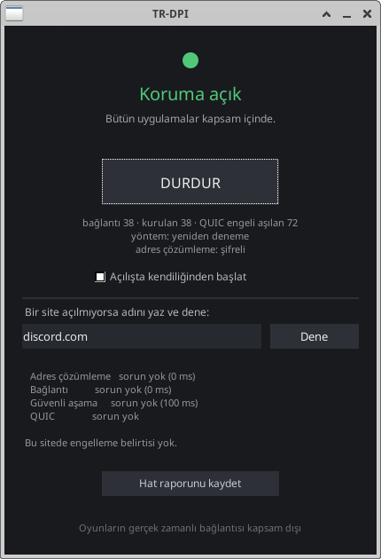

# TR-DPI

Türkiye'de engellenen sitelere erişimi açan Linux uygulaması. Aç, düğmeye bas, biter.

<p align="center">
  
</p>

VPN değil. Uzak sunucu yok, hesap yok, üyelik yok. Trafiğin başka bir yere yönlendirilmiyor.

---

## Kurulum

`.deb` dosyasına **çift tıkla.** Menüde TR-DPI görünür.

Terminal isteyenler için:

```bash
sudo apt install ./trdpi_0.1.0_amd64.deb
```

## Kullanım

Menüden **TR-DPI**'yi aç, **BAŞLAT**'a bas. Yönetici parolan bir kez sorulur.

Pencereyi kapatabilirsin; koruma çalışmaya devam eder. Durdurmak için tekrar açıp **DURDUR**'a bas.

Terminal kullanmak isteyenler için:

| Komut | Ne yapar |
|---|---|
| `sudo trdpi` | ölç, düzelt, koru |
| `trdpi --olc` | yalnızca ölç, hiçbir şey değiştirme (yetki istemez) |
| `sudo trdpi --sure 600` | 10 dakika sonra kendiliğinden geri al |
| `sudo trdpi --durdur` | çalışan kopyaları durdur |
| `sudo trdpi --geri` | yapılan her değişikliği geri al |

## Gerçekten işe yarıyor mu

Gerçek bir Türkiye hattında ölçüldü (Ubuntu 24.04, her hedefe 15 deneme). Koruma kapatılıp tekrar açılarak kontrol edildi:

| | discord.com | roblox.com |
|---|---|---|
| Koruma yok | 0/15 | 0/15 |
| Yalnızca adres düzeltmesi | 8/15 | 7/15 |
| **Tam koruma** | **14/15** | **15/15** |
| Yalnızca adres düzeltmesi *(kontrol)* | 7/15 | 8/15 |

## Nasıl çalışıyor

Ölçtüğümüz hatta engel **iki katmanlıydı**; uygulama ikisini de çözüyor.

**1. Adres çözümlemesine müdahale.** Engellenen siteler sorulduğunda sistem sahte bir adres alıyor (`195.175.254.2` — OONI ölçümlerinde Türkiye'de sansür yanıtı olarak belgelenen adres). O adrese hiçbir şekilde ulaşılamıyor.

Basit görünen çözüm işe yaramıyor: "adres sunucusunu 1.1.1.1 yap" dediğinde de bağlanamıyorsun, çünkü dışarıdaki adres sunucularının standart kapısı kapalı. Uygulama bu yüzden **standart dışı kapıdan** soran kaynakları deneyip çalışanı buluyor ve ayarı yeniden başlatmaya dayanıklı biçimde yazıyor.

**2. Bağlantıların rastgele kesilmesi.** Adres düzeldikten sonra bile bağlantıların yaklaşık yarısı anında kesiliyor. Kesilmeler kümelenmiyor, birbirinden bağımsız — bu yüzden **yeniden denemek** işe yarıyor.

Yeniden deneme yalnızca tarayıcına ya da uygulamana tek bayt bile ulaşmadan önce yapılıyor. Yanıt gelmeye başladıktan sonra yeniden denemek veriyi bozardı.

## Denenip işe yaramayanlar

Bunları yazdık, ölçtük ve bu hatta fark yaratmadıklarını gördük. Kod duruyor; başka davranan ağlarda gerekebilir.

**Trafiği parçalama.** Sabit konumdan bölme, site adının ortasından bölme, hiç bölmeme — üçü de aynı başarısızlık oranını verdi.

**Düşük ömürlü sahte paket.** GoodbyeDPI'ın Windows'ta kullandığı teknik. Ömür değeri 1'den 8'e tarandı, hiçbiri tabandan iyi çıkmadı. Motor mekanik olarak doğru çalışıyor — paketi yakalıyor, sahte kopyayı kuruyor, gönderiyor — ama bu engeli aşmıyor.

## Kaynak kullanımı

Sürekli çalışan tek şey motor. Pencere yalnızca sen açtığında duruyor.

| | Bellek | Dosya |
|---|---|---|
| Motor *(sürekli çalışan)* | **0.65 MB** | 0.9 MB |
| Pencere *(açıkken)* | **16 MB** | 1.2 MB |
| *NetworkManager (karşılaştırma)* | *18 MB* | |
| *Thunar (karşılaştırma)* | *42 MB* | |

Arayüzde web motoru ve OpenGL kullanılmıyor. Aynı pencereyi OpenGL ile de yazıp ölçtük: 115 MB. Ölçüm kararı verdi.

## Hangi dağıtımlarda çalışır

Ubuntu 22.04+ · Debian 12+ · Linux Mint · Pop!_OS · Zorin · elementary · Fedora 36+ · Arch / Manjaro

Paket, desteklenmek istenen **en eski** dağıtımda derleniyor: eski kütüphaneyle derlenen yenide çalışır, tersi çalışmaz. Motor tamamen durağan derlendiği için hiçbir sistem kütüphanesine bağlı değil.

## Ne yapmaz

**UDP trafiğini kapsamaz.** Oyunların gerçek zamanlı bağlantısı bu yöntemden geçmez. Roblox'a giriş yapmak çalışır; oyun içi bağlantı farklı bir yol kullanır.

**Seni gizlemez.** Bu bir VPN değil; kim olduğunu saklamıyor, yalnızca engellenen adreslere ulaşmanı sağlıyor.

## Gizlilik

Telemetri yok. Ölçüm sonuçları hiçbir sunucuya gönderilmiyor.

Program açılınca yeni sürüm var mı diye bakar ve varsa söyler — **kendiliğinden kurmaz.** Motor yönetici yetkisiyle çalıştığı için, sessizce indirilen bir dosyayı root olarak çalıştırmak kabul edilemez bir risk olurdu.

Şunun farkında ol: **ölçümün kendisi ağ üzerinde gözlemlenebilir.** Uygulama bilinen hedeflere istek atar; bu, bağlantını sağlayan taraf için görünür bir izdir. Bu yüzden hedef listesi kısa tutuluyor ve ölçüm arka planda sürekli çalıştırılmıyor.

## Güvenlik tasarımı

- **Pencere asla root çalışmaz.** Yetki gereken işler polkit ile yapılır; masaüstü kendi parola penceresini gösterir.
- **Yalnızca kendi kurallarımıza dokunuruz.** Oluşturulan her firewall kuralı oturum kimliğiyle etiketlenir. Docker, güvenlik duvarı gibi yabancı kurallar ne yedeklenir ne silinir — ve hiçbir komut toplu silme yapmaz.
- **Motor çökerse internet kesilmez.** Kural, dinleyen program yoksa paketleri geçiren biçimde kurulur.
- **Her değişiklik geri alınabilir.** Paket kaldırılırken ağ ayarları da eski haline döner.
- **Ölçüm yokluğu "sorun yok" sayılmaz.** Veri toplanamadıysa sonuç *bilinmiyor*'dur.

## Geliştirme

Rust 1.82+ gerekir.

```bash
cargo test                                   # 223 test
cargo clippy --all-targets -- -D warnings
cargo build -p trdpi-gui                     # arayüz (yalnızca Linux)
bash packaging/deb-olustur.sh                # .deb üret
```

```
crates/
├─ core/          kanonik tipler — I/O yok, platform kodu yok
├─ diagnostics/   ağ ölçümü ve öneri — yetki gerektirmez
├─ dns/           çalışan adres kaynağı bulma ve yönlendirme
├─ transparent/   yönlendirme + yeniden deneme (Linux)
├─ nfqueue/       sahte paket motoru (Linux)
├─ proxy/         yerel SOCKS5 motoru
├─ cli/           tek komut: trdpi
└─ gui/           pencere — web motoru yok
```

Testlerin tamamı gerçek ağ olmadan çalışır. Dağıtım uyumluluğu için `.deb` Ubuntu 22.04 ortamında üretilmelidir.

## Yol haritası

- [x] Ağ ölçümü ve teşhis
- [x] Adres çözümleme düzeltmesi (kalıcı)
- [x] Yeniden deneme motoru
- [x] Grafik arayüz
- [x] Çift tıkla kurulum (.deb)
- [x] Yeni sürüm bildirimi
- [ ] Açılışta otomatik başlatma
- [ ] AppImage ve .rpm
- [ ] QUIC / UDP kapsamı

## Lisans

MIT. Bkz. [LICENSE](LICENSE).
