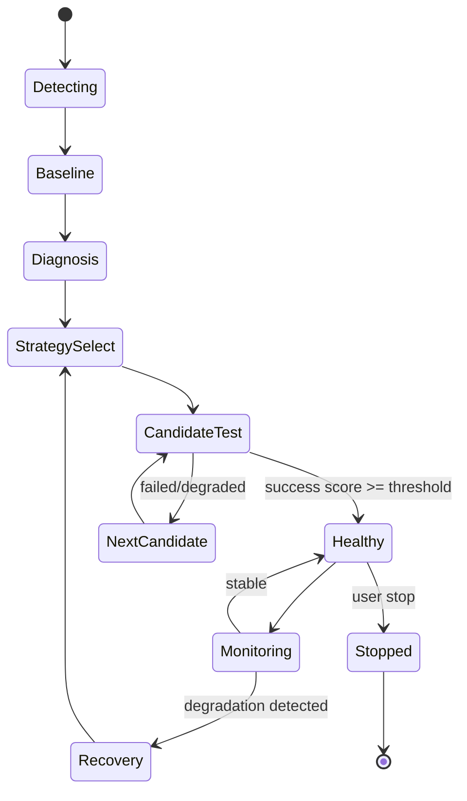
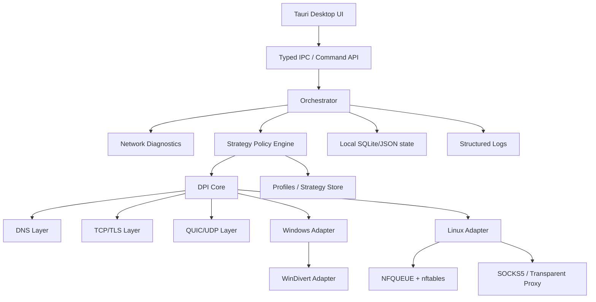
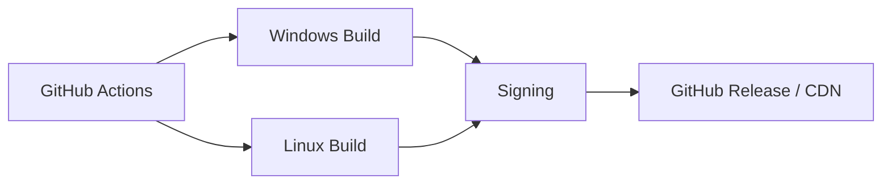
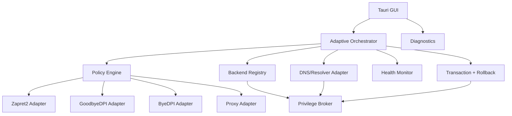

# Türkiye DPI/Censorship Circumvention App — Pazar Araştırması ve Ürün Raporu

**Tarih:** 3 Eylül 2026  
**Hedef:** Türkiye odaklı, Windows `.exe` kurulum deneyimine yakın ve Linux'ta tek dosya/AppImage ile dağıtılabilen, adaptif DPI-engel aşma masaüstü uygulaması  
**Çalışma adı:** `TR-DPI Adaptive`  
**Belge tipi:** Pazar araştırması + teknik ürün gereksinimi + mimari karar dokümanı

> **Kapsam notu:** Bu doküman ağ sansürü/DPI davranışlarını ölçen ve kullanıcı tarafından işletilen bir istemci uygulaması tasarlamak içindir. Uygulama; saldırı, yetkisiz erişim veya başkasının sisteminde ağ manipülasyonu amacıyla tasarlanmamalıdır. Gerçek kullanım ve dağıtım öncesinde Türkiye'deki güncel mevzuat ve uygulamanın dağıtım modeli ayrıca hukukçu tarafından incelenmelidir.

---

## 1. Yönetici Özeti

Türkiye pazarı için yalnızca “GoodbyeDPI'nin Linux portu” yapmak teknik olarak mümkün olsa da ürün açısından zayıf bir konumlandırmadır. Daha güçlü ürün:

1. **Türkiye'yi hedefleyen adaptif motor** kullanır.
2. Önce **tanılama**, sonra **en düşük müdahale seviyesindeki** stratejiyi seçer.
3. Windows'ta WinDivert/benzeri packet interception katmanı; Linux'ta NFQUEUE/nftables ve gerekli olduğunda transparent proxy kullanır.
4. Sistem çapında müdahale mümkün değilse **yerel SOCKS5** gibi fallback modlarına geçer.
5. DNS, TCP, TLS, HTTP/1.1 ve QUIC/HTTP3 gibi ayrı katmanları ayrı ayrı değerlendirir.
6. “Her şeyi zorla uygula” yerine **strateji profilleri + otomatik test + geri alma** mantığı kullanır.
7. Kullanıcıya `Başlat`, `Durdur`, `Otomatik Test` şeklinde basit bir deneyim verir; teknik detayları Gelişmiş ekranına taşır.
8. Linux tarafında “her distro” iddiasını teknik olarak doğru kurar: **tek AppImage + mümkün olduğunca statik/taşınabilir core + ortam tespiti + FUSE'suz extraction fallback**. Çünkü AppImage çok geniş uyumluluk sağlar ama kelimenin tam anlamıyla her distro/kurulumda bağımlılık sorununu garanti edemez.
9. Telemetri varsayılan olarak **kapalı ve içerik/topoloji toplamayan** bir modelde olmalıdır.
10. En büyük farklılaştırıcı “daha fazla bypass flag'i” değil, **Türkiye ağlarında çalışan stratejiyi otomatik bulma ve sürekli doğrulama** olacaktır.

---

# 2. Pazar Göstergeleri

## 2.1 Türkiye'deki internet tabanı

TÜİK'in 2025 Hanehalkı Bilişim Teknolojileri Kullanım Araştırması'na göre 16–74 yaş grubunda internet kullanım oranı %90,9'a çıkmıştır; 2024'te bu oran %88,8'di. Erkeklerde %93,6, kadınlarda %88,2 olarak ölçülmüştür.

**Yorum:** Adreslenebilir kullanıcı tabanı çok büyüktür; ancak bu rakam doğrudan “DPI-bypass müşterisi” anlamına gelmez. Gerçek hedef pazar, internet erişimi sırasında engelleme/bozulma yaşayan ve istemci yazılımı kurabilecek kullanıcıların alt kümesidir.

Kaynak:
- https://veriportali.tuik.gov.tr/Bulten/Index?dil=2&p=Survey-on-Information-and-Communication-Technology-%28ICT%29-Usage-in-Households-and-by-Individuals-2025-53925

## 2.2 Türkiye'de engellenen alan adları

İfade Özgürlüğü Derneği'nin EngelliWeb 2025 raporuna göre:

- 2025 içinde tespit edilen yeni engelli domain/website: **232.441**
- 2024 içindeki yeni engelleme: **314.843**
- 2025 sonu kümülatif engelli domain/website: **1.505.484**
- Bu engeller: **1.284.464 farklı karar**, **875 farklı kurum ve hakimlik** tarafından verilmiş.
- 2025'teki 232.441 domain'in **196.570'i (%84,6)** BTK Başkanı'nın 5651 sayılı Kanun m.8 kapsamındaki idari tedbirleriyle engellenmiş.
- 2025'te Türkiye Futbol Federasyonu kaynaklı engellemeler **16.821 (%7,2)**.
- Milli Piyango İdaresi kaynaklı engellemeler **15.669 (%6,7)**.

Kaynak:
- https://ifade.org.tr/en/reports/engelliweb-2025/01-introduction/
- https://ifade.org.tr/en/reports/engelliweb-2025/03-domain-names-urls-and-content/

### Kümülatif trend

| Yıl sonu | Kümülatif engelli domain/website |
|---|---:|
| 2018 | 347.445 |
| 2019 | 408.494 |
| 2020 | 467.011 |
| 2021 | 574.798 |
| 2022 | 712.558 |
| 2023 | 953.415 |
| 2024 | 1.264.506 |
| 2025 | 1.505.484 |

Bu seri, pazardaki “erişim engeli” probleminin tek seferlik değil, sürekli güncellenen bir problem olduğunu gösterir.

## 2.3 İnternet özgürlüğü göstergesi

Freedom House'un 2025 Türkiye raporunda:

- Internet Freedom skoru: **31/100**
- Durum: **Not Free**
- Access engelleri: 13/25
- Content limits: 10/35
- User rights: 8/40
- Rapor döneminde Instagram yaklaşık **9 gün** engellendi.
- Mart 2025'te protestolar sırasında büyük sosyal ağların erişimi yaklaşık **42 saat** boyunca kısıtlandı.
- Temmuz 2024'te Kayseri'deki olaylar sırasında internet erişiminde yaklaşık **1 hafta** throttling raporlandı.

Kaynak:
- https://freedomhouse.org/country/turkey/freedom-net/2025

Freedom House 2026 ülke raporu ayrıca İFÖD'ün 2024 için **311 binden fazla web adresinin** engellendiğini bildirdiğini aktarıyor.

Kaynak:
- https://freedomhouse.org/country/turkey/freedom-world/2026

## 2.4 Masaüstü OS hedefleme fırsatı

StatCounter'ın Türkiye masaüstü işletim sistemi verisinde 2026'nın ilk yarısında Windows açık ara en büyük platform olmaya devam ederken Linux birkaç puanlık paya sahiptir. Örneğin Haziran 2026 görünümünde:

- Windows: **%69,58**
- Linux: **%4,93**
- macOS: **%4,57**
- Chrome OS: **%0,04**
- Unknown: **%16,21**

Kaynak:
- https://gs.statcounter.com/os-market-share/desktop-/turkey/2025

**Ürün sonucu:** Windows birincil ticari hedef; Linux ise küçük fakat teknik olarak değerli bir niş. Linux için iyi paketleme, geliştirici/ileri kullanıcı kitlesinde marka etkisi oluşturabilir.

---

# 3. Türkiye'de Gözlenen Engelleme/DPI Davranışları

“Türkiye'deki bütün DPI'lar” tek bir donanım ürünü veya tek bir kural değildir. Gözlenen davranışları **mekanizma sınıfları** olarak ele almak gerekir.

## 3.1 DNS tabanlı müdahale

OONI ölçümleri Türkiye'deki bazı engellemelerde DNS çözümünün sansürle ilişkili IP'ler döndürdüğünü gösteriyor.

Örneğin Instagram engellemesinde 2024-08-02 ile 2024-08-10 arasında en az altı ağda `195.175.254.2` adresiyle ilişkili DNS cevabı gözlendi.

Kaynak:
- https://explorer.ooni.org/findings/2024-turkiye-blocked-instagram

Boykotyap için Mart 2025'te OONI, yine `195.175.254.2` ile ilişkili DNS cevabını ve en az beş ağda doğrulanmış blok sinyalini bildirdi.

Kaynak:
- https://explorer.ooni.org/findings/2025-trkiye-blocked-the-opposition-campaign-boykotyap-amid-prote

### Ürün anlamı

Uygulama:
- sistem resolver'ını analiz etmeli,
- DNS poisoning/tampering sinyallerini ayırt etmeli,
- DoH/DoT/alternatif resolver desteği sunmalı,
- ancak DNS değişikliğini tek başına “DPI bypass” gibi göstermemeli.

## 3.2 TLS seviyesinde müdahale / bağlantı resetleme

OONI'nin Discord raporunda, bağlantının TLS handshake'inin ilk write işleminden sonra resetlenmesiyle tutarlı anomaliler raporlandı. Bu, yalnızca klasik DNS engellemesinden farklı bir katman davranışıdır.

Kaynak:
- https://explorer.ooni.org/findings/2025-turkiye-blocked-discord

### Ürün anlamı

Motorun en az:
- TCP ilk veri paketleri,
- TLS ClientHello,
- SNI görünürlüğü,
- bağlantı reset / timeout,
- ilk paket gecikmesi

gibi sinyalleri ölçmesi gerekir.

## 3.3 Hedefli throttling

OONI'nin 2023 Twitter raporunda Türkiye'de Twitter trafiğinin DNS müdahalesi ve **hedefli throttling** ile kısıtlandığı gözlendi. Bazı ağlarda başarılı TLS handshake yaklaşık **70 ms'den 3 saniyenin üzerine** çıkmıştır.

Kaynak:
- https://explorer.ooni.org/findings/2023-turkey-blocked-twitter-following-deadly-earthquake

2024 sonundaki teknik analizlerde Türkiye'deki throttling davranışının HTTP Host ve TLS SNI alanlarını kullanarak tetiklenen klasik DPI mantığıyla tutarlı olduğu gösterildi.

Kaynak:
- https://github.com/net4people/bbs/issues/413

### Ürün anlamı

“Bağlantı çalışıyor ama aşırı yavaş” vakası da bir hata kategorisidir.

Bu nedenle uygulama sadece:

`PASS / BLOCKED`

değil:

`PASS / DEGRADED / THROTTLED / DNS_TAMPER / TCP_RESET / TLS_INTERFERENCE / TIMEOUT`

gibi durumlar üretmelidir.

---

# 4. Olay Bazlı Türkiye Test Matrisi

| Olay / servis | Kaynak | Tarih | Gözlenen mekanizma | Ürün açısından değer |
|---|---|---|---|---|
| Twitter | OONI | 08.02.2023 | DNS interference + throttling | latency tabanlı teşhis |
| Instagram | OONI | 02–10.08.2024 | DNS/censorship fingerprint | DNS + IP teşhisi |
| Discord | OONI | 08.10.2024– | TLS seviyesinde interference/reset | TLS handshake profilleme |
| Boykotyap | OONI | 28.03.2025– | DNS/censorship IP fingerprint | otomatik hedef testi |

Bu tablo kapsamlı bir “tüm bloklar” listesi değildir; kamuya açık ölçümlerle doğrulanmış önemli örneklerin ürün tasarımına çevrilmiş özetidir.

---

# 5. Rakip ve Referans Analizi

## 5.1 GoodbyeDPI

GoodbyeDPI, Windows'a odaklanan ve WinDivert üzerinden paketleri userspace'e alan bir projedir.

Kamuya açık README'de:

- TCP seviyesinde parçalama
- HTTP persistent-session parçalama
- Host header değişimleri
- HTTP biçim manipülasyonları
- TLS/HTTPS fragmentation
- fake HTTP/HTTPS paketleri
- düşük TTL / yanlış checksum / yanlış sequence-number tabanlı fake paketler

gibi teknikler yer alıyor.

Kaynak:
- https://github.com/ValdikSS/GoodbyeDPI

GitHub görünümünde yaklaşık **28,6k star** ve **2,2k fork** seviyesindedir.

### Güçlü tarafları
- Çok güçlü marka bilinirliği
- Basit Windows kullanımı
- Düşük kullanıcı maliyeti
- Kanıtlanmış packet-level yaklaşım

### Zayıf tarafları
- GUI deneyimi sınırlı
- Linux kullanıcı deneyimi doğrudan ana ürün değil
- Türkiye'ye özgü adaptif profil motoru ürünün merkezinde değil
- Kullanıcı için tanılama/ölçüm UX'i sınırlı
- Tek dosyalık “modern masaüstü ürün” deneyimi daha fazla geliştirilebilir

## 5.2 Zapret

Zapret çok daha geniş bir anti-DPI framework'üdür. Linux tarafında NFQUEUE/nftables/iptables; Windows tarafında ayrı packet-interception yaklaşımı kullanır.

Kaynaklar:
- https://github.com/bol-van/zapret
- https://github.com/bol-van/zapret/blob/master/docs/readme.en.md

Güncel ana projede v72.x serisi release'ler bulunuyor; v72.13 son yayınlardan biri.

Zapret'in teknik zenginliği:
- fake
- fakeknown
- fragment/split
- disorder
- autottl
- sequence/checksum fooling
- UDP/QUIC dahil çeşitli trafik tipleri
- hostlist/autohostlist
- iptables/nftables entegrasyonu
- transparent proxy (`tpws`) / packet-level (`nfqws`) ayrımı

### Güçlü tarafları
- Çok geniş teknik kapsama
- Linux ve Windows
- Otomatik/çoklu strateji yaklaşımına uygun altyapı
- blockcheck mantığı

### Zayıf tarafları
- Yeni kullanıcı için karmaşık
- Parametre uzayı çok geniş
- “App-like” deneyim zayıf
- Varsayılan kullanıcı UX'i GUI ürün seviyesinde değil

## 5.3 Zapret2

Zapret2 ayrı bir anti-DPI projesi olarak yaklaşık **5,3k GitHub star** seviyesindedir.

Kaynak:
- https://github.com/bol-van/zapret2

## 5.4 SpoofDPI

SpoofDPI Go ile yazılmış basit ve hızlı bir proxy yaklaşımıdır; yaklaşık **5,0k GitHub star** seviyesindedir.

Kaynak:
- https://github.com/xvzc/spoofdpi

Güçlü tarafı: basitlik.  
Zayıf tarafı: sistem seviyesinde tam masaüstü kontrolü için ayrıca routing/proxy entegrasyonu gerekir.

## 5.5 ByeDPI

ByeDPI ekosistemi, özellikle local SOCKS5 proxy + OS VPN/proxy entegrasyonu mantığıyla dikkat çekiyor. Android sürümleri yerel proxy mantığında çalışabiliyor; uzak VPN sunucusu gerektirmeyen modeller mevcut.

Kaynak:
- https://github.com/dovecoteescapee/ByeDPIAndroid

## 5.6 sing-box

sing-box çok daha genel bir proxy platformudur; yaklaşık **34,3k GitHub star** ve çok sayıda release'e sahiptir.

Kaynak:
- https://github.com/SagerNet/sing-box

Ancak doğrudan “Türkiye DPI için tüketici masaüstü GUI ürünü” değildir.

---

# 6. Pazar Konumlandırması

## En iyi pozisyonlandırma

> **“VPN değil. Tek tıkla Türkiye ağlarındaki bağlantı engellerini teşhis edip uygun bağlantı stratejisini otomatik seçen açık kaynak masaüstü ağ aracı.”**

Bu mesaj teknik olarak da daha doğru olur.

## Rakip matris

| Özellik | GoodbyeDPI | Zapret | SpoofDPI | ByeDPI | Önerilen ürün |
|---|---:|---:|---:|---:|---:|
| Windows | ✅ | ✅ | ⚠️ | ✅ | ✅ |
| Linux | sınırlı | ✅ | ✅ | ✅ | ✅ |
| Modern GUI | ❌ | ⚠️ | ❌ | ⚠️ | ✅ |
| Auto-diagnosis | ⚠️ | ✅ | ❌ | ⚠️ | ✅✅ |
| Türkiye profilleri | ⚠️ | ✅ topluluk | ⚠️ | ✅ | ✅✅ |
| DNS teşhis | ✅ | ✅ | ⚠️ | ✅ | ✅ |
| QUIC/HTTP3 | gelişiyor | ✅ | ⚠️ | ⚠️ | ✅ |
| Fallback proxy | ❌ | ✅ | ✅ | ✅ | ✅ |
| Health check | ❌ | ⚠️ | ⚠️ | ⚠️ | ✅✅ |
| Rollback | ⚠️ | ⚠️ | ✅ | ✅ | ✅✅ |
| Kullanıcı dostu | ✅ | ❌ | ✅ | ✅ | ✅✅ |
| Tek dosya Linux dağıtımı | ❌ | ⚠️ | ✅ | ⚠️ | ✅ |
| GUI içi canlı log | ❌ | ⚠️ | ⚠️ | ✅ | ✅ |
| Strateji A/B test | ❌ | ✅ araç bazlı | ❌ | ⚠️ | ✅✅ |

---

# 7. Ürün Fikri: Adaptif DPI Engine

## 7.1 Temel fikir

Kullanıcı:

`Başlat`

der.

Motor:

1. ağ ortamını algılar,
2. DNS davranışını test eder,
3. HTTPS baseline ölçer,
4. QUIC erişimini ölçer,
5. hedef testlerini yapar,
6. düşük riskli stratejiden başlayarak test eder,
7. başarı skorları üretir,
8. en iyi profile geçer,
9. periyodik health check yapar,
10. bozulursa başka profile geçer.

Bu yapı “flag generator”dan daha güçlüdür.

---

# 8. Önerilen Durum Makinesi



---

# 9. Teknik Mimari



---

# 10. Modül Tasarımı

## 10.1 UI

Öneri:
- Tauri 2
- React + TypeScript
- Tailwind veya headless component sistemi
- Rust backend

Neden Tauri:
- Windows `.exe` / installer
- Linux AppImage dahil çoklu dağıtım
- Rust native backend ile shell/privileged operations
- Electron'a göre daha küçük paket hedefi

Tauri resmi dokümantasyonunda Linux için AppImage, deb, RPM vb. dağıtımlar; Windows için `.msi` ve NSIS tabanlı `-setup.exe` seçenekleri bulunuyor.

Kaynaklar:
- https://v2.tauri.app/distribute/
- https://v2.tauri.app/distribute/appimage/
- https://tauri.app/distribute/windows-installer/

## 10.2 Orchestrator

Görevleri:
- engine lifecycle
- privilege request
- state machine
- diagnosis
- profile selection
- rollback
- auto-update
- crash recovery

Öneri:
`Rust`

## 10.3 DPI Core

Core iki seviyeli olsun:

### Level A — Proxy Engine

- local SOCKS5
- local HTTP CONNECT
- uygulama bazlı routing
- kullanıcı dostu fallback
- root/admin olmayan ortamlarda mümkün olduğunca çalışabilme

### Level B — System Engine

Windows:
- packet interception adapter
- WinDivert

Linux:
- NFQUEUE
- nftables
- optional transparent proxy

Önemli: GUI ile packet engine arasına bir **platform-neutral interface** koy.

```rust
trait PacketBackend {
    fn capabilities(&self) -> Capabilities;
    fn prepare(&mut self) -> Result<()>;
    fn apply_profile(&mut self, profile: &Profile) -> Result<()>;
    fn stop(&mut self) -> Result<()>;
    fn rollback(&mut self) -> Result<()>;
}
```

---

# 11. Profil Modeli

Bir profil “20 tane flag” değil, bir politika nesnesi olmalı.

```json
{
  "id": "tr-general-balanced",
  "name": "Türkiye - Dengeli",
  "risk": "low",
  "protocols": {
    "dns": "encrypted",
    "tcp": true,
    "tls": true,
    "quic": "adaptive"
  },
  "strategy": {
    "fragment": "adaptive",
    "fake_packets": "adaptive",
    "ttl": "auto",
    "header_normalization": "minimal"
  },
  "health": {
    "success_threshold": 0.82,
    "latency_penalty": 0.20,
    "packet_loss_penalty": 0.30
  }
}
```

---

# 12. Strateji Sınıfları

Aşağıdaki sınıflar kavramsal olarak ayrı tutulmalıdır.

## S0 — Direct baseline

Müdahale yok.

## S1 — DNS normalization

- resolver health
- tampering detection
- DoH/DoT/alternatif resolver
- DNSSEC farkındalığı

## S2 — TCP/TLS fragmentation

İlk veri akışını daha küçük segmentlere bölme gibi teknikler.

GoodbyeDPI ve Zapret gibi projelerde bu yaklaşımın farklı varyasyonları bulunmaktadır.

Kaynaklar:
- https://github.com/ValdikSS/GoodbyeDPI
- https://github.com/bol-van/zapret

## S3 — Desynchronization / fake traffic

DPI'ın gördüğü trafik ile gerçek hedef sunucusunun kabul ettiği trafik arasındaki farktan yararlanan yöntem ailesi.

Zapret dokümantasyonunda fake, autottl, sequence/checksum fooling vb. teknik sınıflar yer alır.

Kaynak:
- https://github.com/bol-van/zapret/blob/master/docs/readme.en.md

## S4 — Header-level normalization

HTTP/1.1 Host/header biçiminin farklılaştırılması gibi uygulama katmanı teknikleri.

GoodbyeDPI dokümantasyonu çeşitli HTTP header/request biçim teknikleri listeler.

Kaynak:
- https://github.com/ValdikSS/GoodbyeDPI

## S5 — QUIC/HTTP3 handling

UDP/443 ve QUIC için ayrı karar ağacı.

Zapret dokümantasyonu QUIC initial packet tanıma ve UDP 443 üzerinde desync seçenekleri içerir.

Kaynak:
- https://github.com/bol-van/zapret/blob/master/docs/readme.en.md

---

# 13. Neden Tek Bir “Türkiye Profili” Yetmez?

Ağlar arasında:
- farklı routing
- farklı DNS yapısı
- farklı mobil/sabit omurga
- farklı throttling noktaları
- farklı middlebox davranışları

bulunabileceğinden, ürün `ISP = tek profil` eşlemesiyle sınırlandırılmamalıdır.

Daha iyi model:

```text
network observation
      ↓
behavior fingerprint
      ↓
candidate profiles
      ↓
A/B probe
      ↓
score
      ↓
best strategy
```

---

# 14. Türkiye İçin ISP Farkındalığı

Kamuya açık OONI verilerinde farklı ASN'ler üzerinde blok sinyalleri görülmüştür. Örnekler:

- AS9121
- AS12735
- AS47524
- AS47331
- AS20978
- AS201411
- AS34984
- AS34296
- AS15897

Örneğin Instagram raporunda AS20978, AS12735, AS201411, AS47524, AS47331 ve AS9121 üzerinde blok sinyali raporlandı.

Kaynak:
- https://explorer.ooni.org/findings/2024-turkiye-blocked-instagram

Boykotyap raporunda AS12735, AS47331, AS47524, AS34984, AS9121 ve AS34296 listelendi.

Kaynak:
- https://explorer.ooni.org/findings/2025-trkiye-blocked-the-opposition-campaign-boykotyap-amid-prote

### Tasarım kararı

ASN'yi kullanıcıya göster:

`Ağ: AS9121`

ama profil seçimini sadece ASN ile belirleme.

---

# 15. Teşhis Motoru

## 15.1 Test paketleri

İlk sürüm hedefleri:

- known-good domain
- known-block-like domain
- HTTPS endpoint
- QUIC capable endpoint
- DNS test name
- API endpoint
- image/static asset endpoint

Her testte:

```text
DNS time
TCP connect time
TLS handshake time
TTFB
HTTP status
redirect
reset count
timeout
packet loss estimate
```

## 15.2 Sonuç skoru

Öneri:

```text
score =
  0.30 * availability
+ 0.20 * handshake_success
+ 0.15 * http_success
+ 0.10 * quic_success
+ 0.10 * low_latency
+ 0.10 * low_reset_rate
+ 0.05 * dns_integrity
```

Bu formül başlangıç ağırlığıdır; gerçek ölçümlerle yeniden kalibre edilmelidir.

## 15.3 Durum sınıflandırması

```text
HEALTHY
DEGRADED
DNS_TAMPERED
TCP_RESET
TLS_INTERFERENCE
THROTTLED
QUIC_BLOCKED
UNKNOWN
```

---

# 16. Otomatik Strateji Seçimi

Pseudo-code:

```text
function choose_strategy(environment):
    baseline = run_baseline_tests()

    if baseline.healthy:
        return DIRECT

    diagnosis = classify_failure(baseline)

    candidates = policy_engine.candidates(diagnosis, environment)

    ranked = rank(candidates)

    for candidate in ranked:
        apply(candidate)
        result = run_short_probe()

        if result.score >= candidate.success_threshold:
            persist(candidate)
            return candidate

        rollback()

    return FALLBACK_PROXY
```

---

# 17. Recovery / Rollback

Bu ürünün en kritik özelliklerinden biri olmalı.

Uygulama:
1. firewall değişikliklerini atomik uygular,
2. önce mevcut kuralların snapshot'ını alır,
3. profile ID'sini state'e yazar,
4. crash sonrası cleanup watchdog çalıştırır,
5. servis kapanınca son kurallarını geri alır,
6. timeout durumunda otomatik rollback yapar.

Örnek state:

```json
{
  "session_id": "uuid",
  "started_at": "2026-09-03T20:00:00Z",
  "platform": "linux",
  "backend": "nfqueue",
  "profile": "tr-balanced",
  "firewall_snapshot": "/var/lib/trdpi/snapshots/....json",
  "healthy": true
}
```

---

# 18. Linux Uyumluluk Stratejisi

## 18.1 “Her distro” gerçeği

AppImage uygulama ve bağımlılıkların büyük bölümünü pakete koyarak geniş dağıtım sağlar; kullanıcıya kurulum yapmadan çalıştırma deneyimi sunar.

Tauri AppImage dokümantasyonunda bu model açıkça destekleniyor.

Kaynak:
- https://v2.tauri.app/distribute/appimage/

Ancak AppImage/FUSE tarafında distro/kurulum özel durumları bulunabilir. Güncel AppImage dokümantasyonu FUSE 2/FUSE 3 farklarına ve FUSE yoksa `--appimage-extract` fallback'ına değiniyor.

Kaynak:
- https://github.com/AppImage/AppImageKit/wiki/FUSE

### Bu nedenle önerilen Linux paket stratejisi

**Tier 1**
- `TRDPI-x86_64.AppImage`

**Tier 2**
- `TRDPI-x86_64.AppImage` + FUSE'suz self-extract fallback

**Tier 3**
- `.deb`
- `.rpm`
- AUR PKGBUILD

Tauri dağıtım sistemi deb/RPM/AUR gibi formatları da destekler.

Kaynak:
- https://v2.tauri.app/distribute/

---

# 19. Linux Backend Capability Matrix

| Özellik | Modern Ubuntu | Debian | Arch | Minimal distro |
|---|---:|---:|---:|---:|
| GUI | ✅ | ✅ | ✅ | ⚠️ |
| AppImage | ✅ | ✅ | ✅ | ⚠️ |
| nftables | ✅ | ✅ | ✅ | ⚠️ |
| NFQUEUE | ✅ | ✅ | ✅ | ⚠️ |
| systemd | ✅ | ✅ | ✅ | ❌/⚠️ |
| SOCKS5 fallback | ✅ | ✅ | ✅ | ✅ |
| auto service install | ✅ | ✅ | ✅ | ⚠️ |

### Tasarım

Uygulama ilk açılışta:

```text
Platform Probe
├── libc
├── kernel
├── nft
├── iptables
├── NFQUEUE
├── CAP_NET_ADMIN
├── systemd
├── WebKit runtime
└── FUSE
```

sonucunu üretmeli.

---

# 20. Yetki Modeli

## Windows

GUI normal kullanıcı olarak açılır.

Motor başlarken:

`Windows UAC`

ile privileged helper başlatılır.

## Linux

GUI normal kullanıcı olarak çalışır.

Ağ değişikliği gerektiğinde:

`polkit / pkexec / privileged helper`

kullanılır.

**GUI'nin tamamını root olarak çalıştırma.**

Önerilen:

```text
trdpi-gui
   ↓
trdpi-helper
   ↓
nftables / nfqueue
```

---

# 21. Windows Paketleme

Tauri Windows installer desteği:

- `.msi`
- NSIS `-setup.exe`

Kaynak:
- https://tauri.app/distribute/windows-installer/

Ürün için ana dağıtım:

`TR-DPI-Setup-x64.exe`

Önerilen kurulum seçenekleri:
- current user
- all users
- startup
- desktop shortcut
- start menu
- uninstall
- service install
- diagnostics tool

---

# 22. Güvenlik Tasarımı

## 22.1 Güvenlik hedefleri

- signed installer
- signed update metadata
- SHA-256 checksum
- reproducible-ish build pipeline
- minimal privileges
- no arbitrary shell execution from renderer
- strict IPC schema validation
- config schema validation
- no remote executable download
- update rollback

## 22.2 Webview güvenliği

Renderer:
- dosya sistemi erişimi yok
- shell erişimi yok
- sadece allowlisted IPC command'leri
- CSP
- input validation

---

# 23. Privacy Model

Varsayılan:

**NO TELEMETRY**

Kaydedilebilecek yerel veriler:
- selected profile
- test result aggregates
- app version
- engine version
- error logs

Varsayılan olarak:
- URL geçmişi
- tam domain geçmişi
- IP logları
- trafik içeriği
- payload

sunucuya gönderilmemeli.

İsteğe bağlı “debug report”:
- kullanıcı açıkça export ederse

---

# 24. UI / UX

## Ana ekran

```text
┌──────────────────────────────────────┐
│ TR-DPI Adaptive                 ⚙    │
│                                      │
│   ● CONNECTION PROTECTION            │
│                                      │
│        [  BAŞLAT  ]                  │
│                                      │
│  Ağ: Türk Telekom                    │
│  Mod: Otomatik                       │
│  Durum: Hazır                        │
│                                      │
│  Son test: 2 dk önce                 │
│  Başarı: —                           │
│                                      │
│ ──────────────────────────────────── │
│  Otomatik Test   Ağ   Günlük   Ayarlar│
└──────────────────────────────────────┘
```

## Başlatıldıktan sonra

```text
● AKTİF

Profil
Türkiye / Adaptive Balanced

Ağ
AS9121

Durum
Healthy

Latency
43 ms

Düzeltmeler
DNS       ✓
TCP/TLS   ✓
QUIC      Auto

[ Durdur ]
```

---

# 25. Gelişmiş ekran

Sekmeler:

1. General
2. Strategy
3. DNS
4. TCP/TLS
5. QUIC
6. Diagnostics
7. Logs
8. Advanced
9. Privacy
10. About

### Strateji ekranı

```text
Preset
○ Automatic
○ Conservative
○ Balanced
○ Aggressive
○ Manual
```

Kullanıcıyı doğrudan 50 flag ile boğma.

---

# 26. Ağ Tanılama Ekranı

```text
DNS Integrity        ✓
HTTPS Baseline       ✓
TLS Handshake        ⚠ 3.2s
QUIC                 ✗
TCP Reset             14
Throttling            DETECTED

Önerilen:
Türkiye / Adaptive-TLS-02

[ Apply ]
```

---

# 27. Motor API

Örnek IPC:

```ts
type EngineStatus =
  | "stopped"
  | "starting"
  | "running"
  | "degraded"
  | "recovering"
  | "error";

interface StartEngineRequest {
  mode: "auto" | "preset" | "manual";
  profileId?: string;
}

interface EngineStatusResponse {
  status: EngineStatus;
  platform: "windows" | "linux";
  backend: "windivert" | "nfqueue" | "proxy";
  profileId: string | null;
  healthScore: number;
}
```

---

# 28. Local Data Model

SQLite önerilir.

## tables

```sql
CREATE TABLE profiles (
  id TEXT PRIMARY KEY,
  name TEXT NOT NULL,
  platform TEXT NOT NULL,
  config_json TEXT NOT NULL,
  created_at TEXT NOT NULL,
  updated_at TEXT NOT NULL
);

CREATE TABLE sessions (
  id TEXT PRIMARY KEY,
  started_at TEXT NOT NULL,
  stopped_at TEXT,
  profile_id TEXT,
  backend TEXT,
  health_score REAL
);

CREATE TABLE diagnostics (
  id TEXT PRIMARY KEY,
  session_id TEXT,
  test_name TEXT,
  result TEXT,
  latency_ms INTEGER,
  detail_json TEXT
);
```

---

# 29. Adaptive Policy Engine

Profil seçimi için features:

```text
asn
country
network_type
dns_tampering
tls_reset
quic_failure
latency
packet_loss
http_failure
ipv6_available
```

İlk sürümde ML kullanma.

**Rule-based ranking** kullan:

```text
if dns_tamper and tls_ok:
    prefer DNS profiles

if tls_reset:
    prefer TLS desync profiles

if quic_failure and tcp_ok:
    prefer QUIC handling / selective disable

if timeout + latency spike:
    classify as throttling

if all system-level modes fail:
    fallback proxy
```

ML ancak gerçek kullanıcı/test verisi biriktikten sonra düşünülebilir.

---

# 30. Test Altyapısı

## Unit

- profile parser
- policy ranking
- state machine
- rollback
- config validation

## Integration

- mock DNS
- mock TCP reset
- mock TLS handshake failure
- fake QUIC availability
- firewall rule lifecycle

## System

Windows:
- WinDivert lifecycle
- UAC helper
- service

Linux:
- nftables
- NFQUEUE
- systemd
- FUSE
- polkit

## Network lab

Yerel test ortamında:
- Linux router
- TC netem
- nftables
- local TLS server
- HTTP/3 test server
- controlled packet mutation

Gerçek ISP testi uygulamanın otomatik online testinin parçası yapılmamalı; kontrollü kullanıcı testleri ve ayrı benchmark pipeline daha güvenlidir.

---

# 31. Performans KPI'ları

Hedefler:

| KPI | Hedef |
|---|---:|
| GUI cold start | < 1.5s |
| Engine start | < 2.5s |
| Auto-diagnosis | < 8s |
| Idle RAM | < 120 MB |
| GUI CPU idle | < 1% |
| Engine CPU typical | < 5% |
| Stop/rollback | < 2s |
| Crash recovery | < 5s |

Bunlar ürün hedefidir; gerçek cihazlarda ölçülmelidir.

---

# 32. Başarı KPI'ları

Sadece “açıldı” metriği kullanılmamalı.

### Teknik

- connection success
- latency overhead
- packet loss
- reset rate
- strategy switch count
- false-positive intervention
- rollback rate

### Ürün

- install → first successful connection
- first-run completion
- auto-mode adoption
- 7-day retention
- crash-free sessions
- support issue rate

---

# 33. Ürün Stratejisi

## MVP

İlk sürümde:

- Windows GUI
- Linux AppImage
- Auto diagnostic
- 3–5 profil sınıfı
- DNS diagnostic
- TCP/TLS strategy abstraction
- QUIC awareness
- rollback
- logs
- local-only diagnostics
- one-click start/stop

## V1

- ISP/ASN fingerprinting
- strategy score
- background health monitor
- profile editor
- import/export
- signed updates
- service mode

## V2

- community strategy registry
- remote signed profile manifest
- statistical success dashboard
- controlled anonymous aggregate telemetry (opt-in)

---

# 34. Vibe Coding İçin Teknoloji Yığını

## Frontend

- Tauri 2
- React
- TypeScript
- Vite
- Tailwind
- Zustand veya Signals tabanlı state

## Backend

- Rust
- serde
- tokio
- tracing
- rusqlite veya sqlx

## Windows

- WinDivert adapter
- Windows service/helper
- UAC elevation

## Linux

- nftables
- NFQUEUE
- raw/packet backend
- polkit helper
- systemd optional

## Packaging

- Tauri AppImage
- NSIS `.exe`
- `.deb`
- `.rpm`
- AUR

---

# 35. Repo Yapısı

```text
trdpi/
├─ apps/
│  └─ desktop/
│     ├─ src/
│     ├─ public/
│     └─ package.json
│
├─ crates/
│  ├─ core/
│  ├─ diagnostics/
│  ├─ policy/
│  ├─ profiles/
│  ├─ platform/
│  ├─ dns/
│  ├─ proxy/
│  ├─ packet/
│  ├─ storage/
│  └─ telemetry/
│
├─ platform/
│  ├─ windows/
│  │  ├─ helper/
│  │  └─ windivert/
│  └─ linux/
│     ├─ helper/
│     ├─ nftables/
│     └─ nfqueue/
│
├─ profiles/
│  ├─ turkey/
│  └─ generic/
│
├─ scripts/
├─ packaging/
│  ├─ appimage/
│  ├─ nsis/
│  ├─ deb/
│  ├─ rpm/
│  └─ aur/
│
├─ tests/
│  ├─ unit/
│  ├─ integration/
│  └─ system/
│
└─ docs/
```

---

# 36. Vibe Coding Kuralları

AI kod üretirken şu kuralları zorunlu yap:

### Kural 1
GUI hiçbir zaman root/admin olarak çalışmasın.

### Kural 2
Renderer doğrudan shell komutu çalıştırmasın.

### Kural 3
Her firewall değişikliği snapshot + transaction şeklinde olsun.

### Kural 4
Her profile schema validated olsun.

### Kural 5
Her packet backend capability raporlasın.

### Kural 6
Bir strateji başarısızsa otomatik rollback olsun.

### Kural 7
Linux'ta distro detection yapılırken sadece `/etc/os-release` ile karar verilmesin; yetenek tespiti yapılsın.

### Kural 8
Windows'ta driver/helper versiyonu GUI'den bağımsız kontrol edilsin.

### Kural 9
Remote config indirilecekse sadece imzalı manifest kabul edilsin.

### Kural 10
“Türkiye profili” dosyası runtime'da immutable olarak gömülü olmak zorunda değil; versioned local profile store kullanılmalı.

---

# 37. Türkiye'ye Özel Veri Modeli

```json
{
  "networkFingerprint": {
    "asn": 9121,
    "dnsTampering": true,
    "tlsReset": true,
    "throttling": false,
    "quicBlocked": false
  },
  "recommendations": [
    {
      "profileId": "tr-tls-balanced",
      "score": 0.91
    },
    {
      "profileId": "tr-tls-conservative",
      "score": 0.77
    }
  ]
}
```

---

# 38. “ISP Preset” Yerine “Behavior Profile”

Yanlış:

`Türk Telekom = Profil 1`

Doğru:

`TLS reset + DNS tamper + IPv4 + QUIC reachable = Profile A`

Bu model gelecekte farklı ülkelerde de çalışır.

Ürünün globalleşmesi böyle kolaylaşır.

---

# 39. Dağıtım Mimarisi



Windows Tauri installer için NSIS veya MSI kullanılabilir; MSI Windows üzerinde oluşturulur. NSIS cross-compile edilebilir ancak Tauri dokümanı bunu doğrudan Windows build'e göre daha az doğrulanmış seçenek olarak belirtiyor.

Kaynak:
- https://tauri.app/distribute/windows-installer/

---

# 40. AppImage Stratejisi

AppImage ana hedef olmalı çünkü kullanıcı:

```text
download
↓
chmod +x
↓
double click
```

deneyimine yakın bir akış yaşayabilir.

Ancak UI'da:

`Linux compatibility check`

ekranı olmalı.

Örnek:

```text
✓ Architecture: x86_64
✓ Kernel: 6.8
✓ nftables
✓ NFQUEUE
✓ privileges helper
⚠ FUSE unavailable

AppImage can still be extracted and run.
```

AppImage resmi dokümantasyonu bu tür FUSE/fallback senaryolarını açıkça ele alıyor.

Kaynak:
- https://github.com/AppImage/AppImageKit/wiki/FUSE

---

# 41. Linux'ta Distro Desteği İçin Doğru Yaklaşım

Hedeflenen distro listesi:

- Ubuntu 22.04+
- Debian 12+
- Arch
- Manjaro
- Fedora
- openSUSE
- Mint
- Pop!_OS
- EndeavourOS
- CachyOS

Tauri'nin güncel Linux geliştirme dokümanı Debian, Arch, Fedora, Gentoo, openSUSE, Alpine ve NixOS gibi dağıtımlar için bağımlılık notları sağlıyor.

Kaynak:
- https://v2.tauri.app/start/prerequisites/

Ürünün runtime tarafında ise paket yöneticisine mümkün olduğunca bağımlı olmamak gerekir.

---

# 42. Ticari Model

Bu ürün için doğrudan ücretli “VPN” modeli gereksiz olabilir.

Daha güçlü seçenekler:

### Free
- temel otomatik mod
- temel diagnostic
- local profiles
- AppImage / Windows

### Supporter
- gelişmiş diagnostic
- gelişmiş grafikler
- cloud-synced profile settings

### Business
- merkezi policy
- organization profiles
- managed deployment

Ancak anti-censorship tarafında açık kaynak topluluk güveni kritik olduğundan **çekirdek engine'i açık kaynak** tutmak daha mantıklı olabilir.

---

# 43. Rakiplerden Ayrışma

En güçlü slogan:

> “Flag değil, otomatik teşhis.”

İkinci güçlü mesaj:

> “VPN olmadan, önce bağlantının neden bozulduğunu bul.”

Üçüncü:

> “Windows + Linux, tek arayüz.”

---

# 44. Önerilen Marka/Ürün Mimari Adları

Çalışma isimleri:

- TRDPI
- DPIFlow
- NetShift
- SANSURX
- NetBypass
- FlowShield
- NetEscape

Marka adı seçilmeden önce domain, GitHub repository ve trademark araştırması yapılmalıdır.

---

# 45. Riskler

## Teknik risk
DPI operatörü stratejileri değiştirebilir.

**Çözüm:** profile update + auto-diagnosis.

## Linux risk
Distro/kernels arası farklılık.

**Çözüm:** capability-based runtime.

## Antivirus risk
Windows packet driver'ları güvenlik yazılımlarında false positive üretebilir.

GoodbyeDPI ve Zapret dokümanlarında WinDivert kaynaklı antivirus uyarıları hakkında kullanıcı bilgilendirmeleri bulunuyor.

Kaynak:
- https://github.com/bol-van/zapret-win-bundle

## Hukuki risk
Türkiye'de erişim engelleme rejimi 5651 sayılı Kanun ve ilgili düzenlemelerle ilişkilidir; BTK'nın İnternet Dairesi erişim engelleme/content removal işlemlerinden sorumludur.

Kaynak:
- https://www.btk.gov.tr/internet-daire-baskanligi
- https://ifade.org.tr/en/reports/engelliweb-2025/01-introduction/

---

# 46. En Önemli Ürün Kararı

Ürünün gerçek “moat”ı packet trick değil.

**Moat = Türkiye Network Intelligence**

Yani:

```text
Measurement
   ↓
Fingerprinting
   ↓
Profile scoring
   ↓
Automatic strategy
   ↓
Feedback
   ↓
Better profile
```

Bu döngü rakiplerin çok sayıdaki flag'inden daha değerlidir.

---

# 47. İlk 30 Günlük Geliştirme Sırası

## Hafta 1
- repo
- Tauri shell
- UI
- Rust orchestrator
- schema
- logging
- Windows build
- Linux AppImage build

## Hafta 2
- privilege helper
- Windows packet backend abstraction
- Linux NFQUEUE abstraction
- DNS diagnostics
- baseline engine

## Hafta 3
- strategy engine
- profiles
- rollback
- health monitor
- QUIC test
- diagnostics UI

## Hafta 4
- packaging
- signing
- updater
- crash recovery
- docs
- release CI
- controlled network lab

---

# 48. MVP Definition of Done

MVP ancak şu şartlarda “tamam” sayılmalı:

- Windows installer kuruluyor.
- Windows'ta UAC doğru çalışıyor.
- Linux AppImage açılıyor.
- Ubuntu/Debian/Arch üzerinde capability check geçiyor.
- GUI admin/root çalışmıyor.
- Engine helper üzerinden çalışıyor.
- Start/Stop deterministik.
- Firewall rollback testten geçiyor.
- Diagnostic ekranı latency/handshake/DNS sonuçlarını gösteriyor.
- 3+ strateji profili mevcut.
- başarısız profile otomatik rollback yapılıyor.
- QUIC durumu gösteriliyor.
- crash sonrası sistemin ağ kuralları temiz kalıyor.
- code signing/release pipeline mevcut.
- privacy policy UI içinde açıkça anlatılıyor.

---

# 49. Nihai Öneri

Bu projeyi:

> **“GoodbyeDPI for Linux”**

olarak başlatma.

Şu ürün tanımı daha güçlü:

> **Türkiye odaklı, adaptif, açık kaynak, cross-platform DPI diagnosis + circumvention desktop client.**

Teknoloji:

**Tauri 2 + React/TypeScript + Rust Orchestrator + platform adapter + WinDivert/NFQUEUE + AppImage/NSIS**

MVP:

**Windows + Linux + Auto Diagnosis + Adaptive Profiles + Rollback + Modern GUI**

En önemli metrik:

**“İlk çalıştırmadan başarılı bağlantıya geçen kullanıcı oranı.”**

---

# 50. Kaynaklar

1. TÜİK 2025 ICT Usage Survey  
   https://veriportali.tuik.gov.tr/Bulten/Index?dil=2&p=Survey-on-Information-and-Communication-Technology-%28ICT%29-Usage-in-Households-and-by-Individuals-2025-53925

2. İFÖD EngelliWeb 2025 — Introduction  
   https://ifade.org.tr/en/reports/engelliweb-2025/01-introduction/

3. İFÖD EngelliWeb 2025 — Domain/URL Blocking  
   https://ifade.org.tr/en/reports/engelliweb-2025/03-domain-names-urls-and-content/

4. Freedom House — Turkey Freedom on the Net 2025  
   https://freedomhouse.org/country/turkey/freedom-net/2025

5. Freedom House — Turkey 2026  
   https://freedomhouse.org/country/turkey/freedom-world/2026

6. OONI — Türkiye blocked Instagram  
   https://explorer.ooni.org/findings/2024-turkiye-blocked-instagram

7. OONI — Türkiye blocked Discord  
   https://explorer.ooni.org/findings/2025-turkiye-blocked-discord

8. OONI — Türkiye blocked Boykotyap  
   https://explorer.ooni.org/findings/2025-trkiye-blocked-the-opposition-campaign-boykotyap-amid-prote

9. OONI — Turkey blocked Twitter / throttling  
   https://explorer.ooni.org/findings/2023-turkey-blocked-twitter-following-deadly-earthquake

10. net4people/bbs — Exploration of Turkey's TCP throttling  
    https://github.com/net4people/bbs/issues/413

11. GoodbyeDPI  
    https://github.com/ValdikSS/GoodbyeDPI

12. Zapret  
    https://github.com/bol-van/zapret

13. Zapret documentation  
    https://github.com/bol-van/zapret/blob/master/docs/readme.en.md

14. Zapret2  
    https://github.com/bol-van/zapret2

15. SpoofDPI  
    https://github.com/xvzc/spoofdpi

16. ByeDPI Android  
    https://github.com/dovecoteescapee/ByeDPIAndroid

17. sing-box  
    https://github.com/SagerNet/sing-box

18. Tauri distribution  
    https://v2.tauri.app/distribute/

19. Tauri AppImage  
    https://v2.tauri.app/distribute/appimage/

20. Tauri Windows installer  
    https://tauri.app/distribute/windows-installer/

21. Tauri prerequisites  
    https://v2.tauri.app/start/prerequisites/

22. AppImage FUSE  
    https://github.com/AppImage/AppImageKit/wiki/FUSE

---

## Araştırmanın sınırı

Bu rapor kamuya açık web kaynakları ve proje dokümantasyonlarından oluşturulmuştur. “Türkiye'deki bütün DPI cihazlarının exact üretici/model/configuration envanteri” kamuya açık değildir; OONI ve benzeri ölçümler **davranış/fingerprint** üzerinden çıkarım yapmaya izin verir, ancak operatörlerin kapalı ağ donanımı ve kural setinin eksiksiz envanterini vermez. Bu nedenle teknik tasarımda kesin cihaz isimlerinden ziyade **ölçülebilir ağ davranışları** temel alınmıştır.


# 51. Yeni Araştırma: SplitWire-Turkey ve GoodbyeDPI-Turkey

Bu iki proje ürün tasarımında referans kabul edilmelidir.

## GoodbyeDPI-Turkey'den çıkarılacak ürün dersleri

Repository, Windows üzerinde servis kurulumu ile yeniden başlatma sonrasında otomatik çalışma ve Türkiye'ye özel alternatif yöntemler sunuyor. README'de özellikle Superonline için birden fazla alternatif yöntem, bazı yöntemlerde TTL kaynaklı site yavaşlığı ve Discord uygulaması ile web erişiminin farklı davranabileceği gibi gerçek saha sorunları belgelenmiş. Ayrıca DNS'in kullanılan yönteme göre otomatik veya manuel ayarlanabildiği belirtiliyor.

Kaynak:
- https://github.com/cagritaskn/GoodbyeDPI-Turkey

**Bizim üründeki karşılığı:**
- “ISP preset” yerine saha gözleminden oluşan davranış profilleri
- TTL gibi bağlantı kalitesini bozabilecek seçeneklerin otomatik olarak düşük önceliğe alınması
- uygulama/web farkını ayrı health probe olarak ölçme
- DNS değişikliğinin kullanıcıdan manuel istenmemesi
- servis/daemon yaşam döngüsünün uygulama tarafından yönetilmesi

## SplitWire-Turkey'den çıkarılacak ürün dersleri

SplitWire-Turkey, tek GUI içinden birden fazla erişim/aşım yaklaşımını kurup yönetmeye odaklanıyor. README'de Windows servisleri, DNS + DoH ayarları, hizmetlerin kaldırılması, geri alma ve dil desteği gibi kullanıcı deneyimi unsurları bulunuyor. Ayrıca repository, çeşitli yöntemler arasında otomasyon sağlamayı hedefliyor.

Kaynak:
- https://github.com/cagritaskn/SplitWire-Turkey

**Bizim üründeki karşılığı:**
- Kullanıcı “Zapret mi GoodbyeDPI mı?” diye karar vermeyecek.
- Orchestrator uygun backend'i kendisi seçmeli.
- Kurulumdan kaldırmaya kadar bütün sistem değişiklikleri uygulamanın transaction/rollback katmanından yönetilmeli.
- DNS/DoH/system-proxy gibi ayarlar tek tek işletim sistemi menülerine bırakılmamalı.
- “Advanced” ekranı sadece bilgi/ince ayar için bulunmalı; temel işlev için terminal gerekmemeli.

---

# 52. Nihai Ürün Farkı: Invisible Linux Setup

Asıl hedef artık:

> **Linux'ta terminal gerektirmeyen, sistem ayarlarıyla elle uğraştırmayan, Windows uygulaması gibi çalışan anti-DPI masaüstü uygulaması.**

Kullanıcı akışı:

```text
AppImage indir
    ↓
uygulamayı aç
    ↓
Linux capability check
    ↓
[ Yetki gerekiyor ]
    ↓
grafiksel polkit onayı
    ↓
helper hazırlanır
    ↓
backend otomatik seçilir
    ↓
diagnostic
    ↓
uygun profil
    ↓
aktif
```

Kullanıcıdan beklenmemeli:

```text
sudo ...
nft ...
iptables ...
systemctl ...
sysctl ...
export ...
chmod ...
proxy ayarı...
DNS ayarı...
```

Uygulama bunları **kullanıcı arayüzünün arkasında** gerektiği kadar otomatik yapmalıdır.

---

# 53. “Tek Tık Linux” Gerçeği

Linux'ta “kullanıcı terminal görmeyecek” mümkün; “hiçbir privilege mekanizması kullanılmayacak” ise system-level networking için gerçekçi değildir.

Doğru model:

```text
Non-root GUI
      │
      ├── capability detection
      │
      └── privilege broker
              │
              ├── polkit
              └── small signed helper
                       │
                       ├── nftables
                       ├── NFQUEUE
                       ├── routing/proxy
                       └── cleanup
```

**Kural:** GUI root olarak çalışmayacak.

---

# 54. Linux Bootstrap Wizard

İlk çalıştırmada:

```text
┌──────────────────────────────────────────┐
│ TR-DPI Adaptive                          │
│                                          │
│ Linux sisteminiz analiz ediliyor...      │
│                                          │
│ ✓ Kernel uyumlu                          │
│ ✓ Network interface bulundu              │
│ ✓ nftables bulundu                       │
│ ✓ NFQUEUE desteği bulundu                │
│ ✓ Yetki mekanizması bulundu              │
│                                          │
│ Hazır.                                   │
│                                          │
│            [ Otomatik Kur ve Başlat ]    │
└──────────────────────────────────────────┘
```

Başka sistem ayarını kullanıcıya gösterme.

---

# 55. Backend Selection Logic

Önerilen sıralama:

```text
if packet interception supported:
    choose native packet backend

else if transparent proxy supported:
    choose transparent proxy

else if local proxy supported:
    choose local proxy

else:
    diagnostic-only
```

Bu karar Linux dağıtım adına değil **capability** verisine dayanır.

---

# 56. Backend Bundle Stratejisi

Ürün üçüncü taraf motorların kullanıcıya ayrı kurulmasını gerektirmemeli.

Dağıtım seçenekleri:

### A — Native engine
Kendi Rust/C/C++ packet-processing katmanın.

### B — Embedded backend
Lisansı uygun olan upstream motorun binary/library olarak paketlenmesi.

### C — Wrapper backend
Mevcut açık kaynak motorların process lifecycle'ının uygulama tarafından yönetilmesi.

**Öneri:** İlk sürümde B/C; daha sonra olgunlaşan fonksiyonlar için A.

Böylece ilk MVP'de yıllarca geliştirilmiş packet-processing mantığını sıfırdan yeniden yazma riski azaltılır.

---

# 57. Zapret2'nin Konumu

Zapret2 özellikle önemli çünkü upstream proje Linux, FreeBSD, OpenBSD ve Windows dahil çok-platformlu hedefler ve embedded/router kullanımını gözetiyor; repository içinde `nfq2`, `blockcheck2`, `mdig`, `ip2net`, `ipset` ve init/installation bileşenleri bulunuyor.

Kaynak:
- https://github.com/bol-van/zapret2

Bizim mimaride:

```text
Zapret2
   ↓
Adapter
   ↓
Backend Capability
   ↓
Policy Engine
```

Kullanıcı Zapret2 kurduğunu/çalıştırdığını bilmek zorunda değil.

---

# 58. Blockcheck'i Ürün Özelliğine Dönüştürme

Zapret/Zapret2 ekosistemindeki blockcheck yaklaşımı ürünün en değerli fikirlerinden biridir.

Ancak kullanıcıya:

`blockcheck.sh`

çalıştırma.

Onun yerine:

```text
Automatic network diagnosis
         ↓
Candidate profile tests
         ↓
Success ranking
         ↓
Best profile
```

ver.

Bu, CLI aracını consumer UX özelliğine dönüştürür.

---

# 59. Üç Katmanlı Motor

```text
Layer 1 — Diagnose
Layer 2 — Adapt
Layer 3 — Execute
```

### Diagnose
Problemin DNS/TCP/TLS/QUIC/throttling sınıfını bul.

### Adapt
Uygun profile adaylarını sırala.

### Execute
Seçilen backend'i uygula.

Bu ayrım ürünün test edilebilirliğini artırır.

---

# 60. Sistem Değişikliği Transaction'ı

Linux'taki her değişiklik:

```text
DISCOVER
   ↓
SNAPSHOT
   ↓
PREPARE
   ↓
APPLY
   ↓
VERIFY
   ↓
COMMIT
```

Hata:

```text
RESTORE SNAPSHOT
   ↓
VERIFY CLEAN
```

Snapshot içine mümkün olduğunca:
- ilgili nftables state
- oluşturulan chain/table isimleri
- proxy listeners
- helper state
- uygulamanın oluşturduğu routes
- DNS/proxy changes

alınmalı.

**Başka uygulamalara ait firewall state'i silme.**

---

# 61. Çakışma Yönetimi

Linux makinede kullanıcı aynı anda:
- VPN
- Docker
- Tailscale
- WireGuard
- Clash/sing-box
- başka firewall frontend'i

kullanabilir.

Uygulama:
1. mevcut durumu keşfeder,
2. kendi oluşturduğu objelere benzersiz isim verir,
3. sadece kendi objelerini değiştirir,
4. Stop işlemi sırasında sadece kendi objelerini geri alır.

Örnek prefix:

```text
trdpi_
trdpi_nft
trdpi_proxy
trdpi_session_<uuid>
```

---

# 62. DNS UX

Kullanıcıya “DNS adresini değiştir” demek yok.

Tanılama:

```text
DNS integrity       ✓
Resolver reachable  ✓
Tampering signal    detected
```

Gerekirse uygulama, seçilen backend'in gerektirdiği DNS yaklaşımını **privileged helper üzerinden** uygular.

Ancak DNS değişikliği global olmak zorunda değil; mümkünse uygulama içi resolver/proxy veya seçici routing ile kapsam daraltılmalı.

---

# 63. System Proxy UX

Genel kural:

**Sistem proxy'sini global olarak değiştirmek son çare.**

Tercih sırası:

```text
1. transparent/system packet backend
2. app-scoped interception
3. local proxy
4. global system proxy
```

Böylece kullanıcı başka uygulamalarında beklenmedik davranış görmez.

---

# 64. Kullanıcı Deneyimi: “Hiç Teknik Bilgi Yok”

Ana ekran sadece:

```text
Bağlantı Durumu
● Aktif

Profil
Otomatik

Ağ
Algılanıyor...

Performans
Normal

[ Durdur ]
```

Tanılama sonucunda:

```text
Bağlantınızda engelleme belirtisi algılandı.
Uygun bağlantı yöntemi otomatik seçildi.
```

Asla ilk ekranda:

```text
--dpi-desync=fake
--hostcase
--split-pos
--ttl
nfqws
nftables
```

gösterme.

---

# 65. Gelişmiş Ekran

Teknik kullanıcı için:

```text
Backend: NFQUEUE
Engine: zapret2-adapter
Profile: TR-TLS-03
Health: 94/100
DNS: encrypted
QUIC: adaptive
IPv6: enabled
```

Ham parametrelerin doğrudan düzenlenmesi ancak “Developer/Expert mode” altında olabilir.

---

# 66. Ürün Mimarisi Güncellemesi

Yeni öneri:



---

# 67. Backend Registry

```rust
pub trait Backend: Send + Sync {
    fn id(&self) -> &'static str;
    fn capabilities(&self) -> Capabilities;
    fn probe(&self, context: &ProbeContext) -> Result<ProbeResult>;
    fn prepare(&self) -> Result<Snapshot>;
    fn apply(&self, profile: &Profile) -> Result<()>;
    fn verify(&self) -> Result<HealthResult>;
    fn stop(&self) -> Result<()>;
    fn rollback(&self, snapshot: Snapshot) -> Result<()>;
}
```

Registry:

```text
zapret2
goodbyedpi
byedpi
proxy
dns
```

Not every backend must exist on every platform.

---

# 68. Linux AppImage İçin Özel Tasarım

AppImage'in içinde:

```text
trdpi-gui
trdpi-orchestrator
trdpi-helper-installer
diagnostic binaries
profile database
icons/resources
```

bulunabilir.

Ancak runtime system dependency olduğu için açılışta capability check yapılmalı.

FUSE yoksa uygulama:
- kullanıcıya terminal komutu yazdırmak yerine,
- grafiksel fallback/extraction workflow
sunmalı.

Örneğin:

```text
Bu Linux sisteminde AppImage mount özelliği kullanılamıyor.

[ Uygulama modunda çalıştır ]
```

---

# 69. Linux Kurulum Modları

### Portable
AppImage doğrudan çalışır.

### Integrated
Kullanıcı isterse uygulama:
- desktop entry
- icon
- autostart
- privileged helper

kurabilir.

Bunların tamamı GUI içinden yapılır.

### Service
Kullanıcı “başlangıçta otomatik çalıştır” işaretler.

Uygulama uygun init sistemini algılar:
- systemd
- OpenRC
- diğer desteklenen init

Desteklenmeyen sistemde kullanıcıya açık hata ve alternatif sunulur.

---

# 70. V1 İçin Daha Sağlam Kapsam

Windows:
- `.exe` setup
- service/helper
- packet backend
- auto profile

Linux:
- AppImage
- Ubuntu/Debian/Arch ana hedef
- NFQUEUE/nftables
- graphical privilege flow
- fallback proxy
- startup integration

**MacOS V1 kapsamına alınmamalı.**

---

# 71. Yeni Rekabet Tanımı

Ürünümüz:

**GoodbyeDPI-Turkey'nin saha profillerini**
+
**SplitWire-Turkey'nin multi-method orchestration'ını**
+
**Zapret/Zapret2'nin multi-platform packet engine yaklaşımını**
+
**ByeDPI/SpoofDPI'nin proxy fallback mantığını**
+
**consumer-grade GUI + automatic diagnosis + rollback**

tek bir üründe birleştirmeyi hedefler.

Bu, “bir fork daha” değil; **üst seviye orchestration/product layer** olur.
